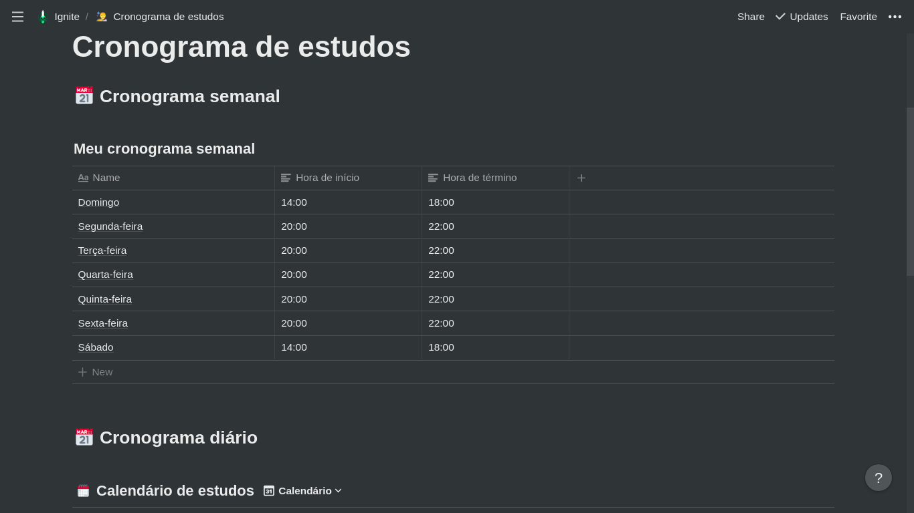
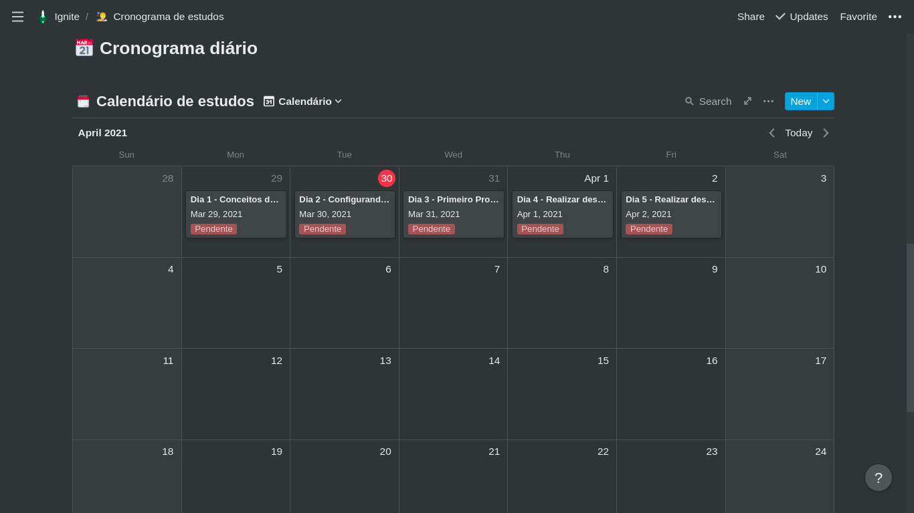

# Cronograma de estudos

💡 Objetivo: Fazer com que o Ignite entre na sua rotina diária da melhor maneira possível.

Nesse desafio, você deve planejar os seus estudos.

Para isso, você deve criar um cronograma que irá se adaptar ao seu tempo e ritmo.

Defina qual será seu horário de estudo, criando tarefas que estarão atreladas a um calendário, para se manter com foco e sempre alinhado com seus objetivos!

## Cronograma semanal
 

  

## Cronograma diário
 

  

 

Feito com 💜 por Anderson Fernandes 👏 <a href="https://www.linkedin.com/in/anderson-fernandes96/">Entre em contato</a>
